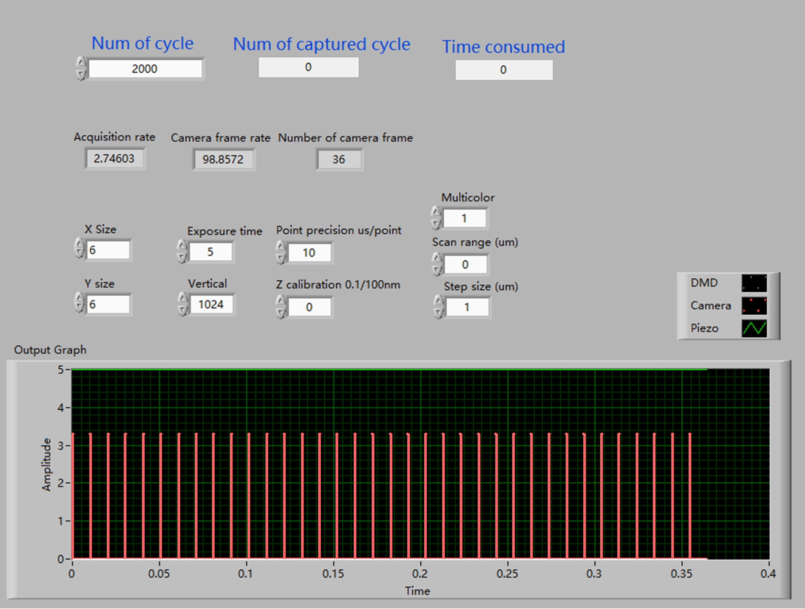
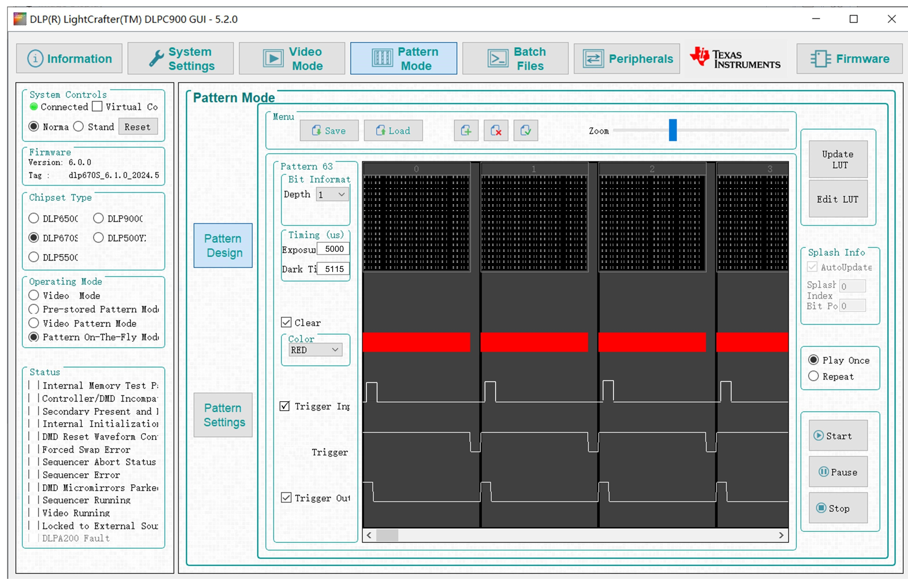

# C2SD-ISM Hardware Parameter Configuration

A high-speed, structured-illumination microscopy system using DMD-based scanning, synchronized multicolor control, and axial Z-stack acquisition.

This repository provides hardware configuration details for the **C2SD-ISM microscope system**, including:

- LabVIEW parameter interface  
- Camera software (Hamamatsu HCImageLive) configuration  
- DMD control logic and synchronization  
- Explanation of acquisition parameters

The C2SD-ISM system shares its LabVIEW control logic with MC-ISM. The following sections describe how the control parameters are set and how they correspond across devices.

> For more details on camera software settings, please refer to the [Hamamatsu HCImageLive official documentation](https://hcimage.com/support/).

---

## Parameter Table: LabVIEW Front Panel

| **Parameter Name**         | **Property**         | **Description**                                                                 |
|---------------------------|----------------------|---------------------------------------------------------------------------------|
| `X size`                  | Adjustable           | Number of DMD patterns to switch in the horizontal direction.                  |
| `Y size`                  | Adjustable           | Number of DMD patterns to switch in the vertical direction.                    |
| `Scan range (µm)`         | Adjustable           | Axial (Z-axis) depth scan range.                                               |
| `Step size (µm)`          | Adjustable           | Axial step size between adjacent Z-slices.                                     |
| `Multicolor`              | Adjustable           | Number of laser wavelengths used for multicolor imaging.                       |
| `Exposure time`           | Adjustable           | Camera exposure time.                                                          |
| `Vertical`                | Adjustable           | Number of image rows acquired. Affects camera readout time.                    |
| `Point precision (µs/pt)` | Adjustable           | Sampling precision (typically 10 µs per point).                                |
| `Z calibration`           | Adjustable           | Initial Z-position calibration of the piezo scanning stage.                    |
| `Num of cycle`            | Adjustable           | Number of axial and multicolor scanning cycles.                                |
| `Num of captured cycle`   | Adjustable           | Number of acquisition cycles actually captured.                                |
| `Time consumed`           | Auto-calculated      | Total time consumed per full scan cycle.                                       |
| `Camera frame rate`       | Auto-calculated      | Frame rate under external trigger mode (must match camera software exactly).   |
| `Number of camera frame`  | Auto-calculated      | Number of frames per acquisition cycle (must match camera software).           |
| `Acquisition rate`        | Auto-calculated      | Overall acquisition speed (calculated from timing).                            |

---

## Matching Software Interfaces

> **Important**: Ensure that DMD triggering and camera exposure are synchronized through LabVIEW to avoid frame mismatches or timing errors.

### LabVIEW and Camera Panels

